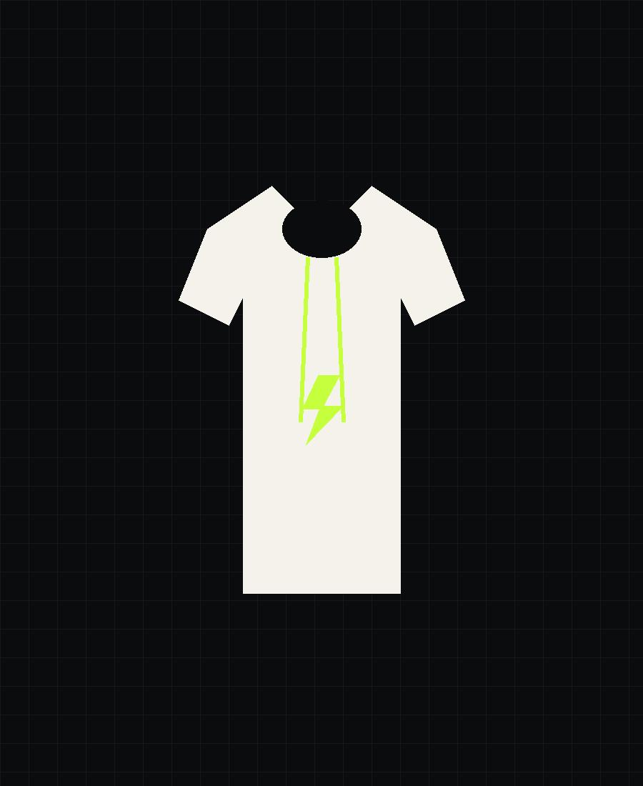

# KILOVAULT — Streetwear Site

A 5-page static site (Home, Shop, Cart, About, Contact) ready to push to GitHub and host on GitHub Pages.

## Structure

```
your-brand/
├── index.html
├── shop.html
├── cart.html
├── about.html
├── contact.html
├── css/style.css
├── js/script.js
└── images/
    ├── logo.png
    ├── hero-bg.jpg
    ├── tshirt1.jpg, tshirt2.jpg, tshirt3.jpg
    ├── hoodie1.jpg, hoodie2.jpg
    ├── joggers1.jpg, tote1.jpg
    └── cap1.jpg
```

## Color theme

| Token       | Hex       | Use                          |
|-------------|-----------|-------------------------------|
| Obsidian    | `#0B0C0E` | Background                    |
| Obsidian Soft | `#16181B` | Cards, inputs               |
| Off-White   | `#F4F2EA` | Primary text, light surfaces  |
| Electric Lime | `#C6FF3D` | Accent — CTAs, highlights   |
| Stone       | `#8A8D91` | Secondary/muted text          |

Fonts (Google Fonts, loaded via CDN): **Anton** (display headlines), **Inter** (body copy), **Space Mono** (labels, prices, UI text).

---

## Adding your real products

This is the main thing you'll edit. Every product lives directly in the HTML — there's no database or admin panel, so you're editing plain text and image files.

**1. Product photos**
Drop your real photos into `/images`, using clear filenames (e.g. `hoodie1.jpg`). Any size works, but square-ish or portrait (3:4) photos look best in the grid — the CSS crops to fit automatically.

**2. Where a product is defined**
Each product is one `<article class="product-card">` block, repeated in `shop.html` (full catalog) and `index.html` (3 featured items). A block looks like this:

```html
<article class="product-card" data-category="hoodies">
  <div class="product-media">
    <span class="product-tag">Best Seller</span>              <!-- optional badge, delete if not needed -->
      <!-- 1. swap the image path -->
  </div>
  <div class="product-info">
    <div class="name">Kilovault Hoodie</div>                   <!-- 2. product name -->
    <div class="spec">420GSM · Heavyweight Fleece</div>        <!-- 3. short spec / description line -->
    <div class="product-foot">
      <span class="price">$88.00</span>                        <!-- 4. price shown on the card -->
    </div>
    <div class="charge-meter" aria-hidden="true">               <!-- 5. optional: how many "seg on" = how full the bar looks -->
      <span class="seg on"></span><span class="seg on"></span><span class="seg on"></span><span class="seg on"></span><span class="seg"></span>
    </div>
    <span class="charge-label">Warmth · High charge</span>
    <button class="add-btn"
      data-id="hoodie1"                                        <!-- 6. unique ID, no spaces, must be unique per product -->
      data-name="Kilovault Hoodie"                              <!-- 7. same name as above -->
      data-price="88.00"                                        <!-- 8. plain number, no $ sign -->
      data-spec="420GSM · Heavyweight Fleece"
      data-image="images/hoodie1.jpg">
      Add to Cart
    </button>
  </div>
</article>
```

To add a **new** product: copy one whole `<article>...</article>` block, paste it inside the `<div class="product-grid">`, then edit the 8 numbered spots above. Give it a unique `data-id` (e.g. `"tee4"`) — the cart uses this to tell products apart.

To **remove** a product: delete its whole `<article>...</article>` block.

`data-category` controls which shop filter (Hoodies / Tees / Bottoms / Accessories) picks it up — use one of the existing category names, or add a new filter button in the `.filter-bar` at the top of `shop.html` with a matching `data-filter`.

**3. Pricing**
Price appears in two places per product — keep them in sync:
- `<span class="price">$88.00</span>` — what the customer sees
- `data-price="88.00"` — what the cart math uses (no `$`, no commas)

**4. Descriptions / copy**
Longer brand copy (About page story, homepage brand statement, etc.) is just paragraph text (`<p>...</p>`) — edit directly in `about.html` and `index.html`.

**5. Social links**
Search each HTML file for `instagram.com` and replace with your real profile URL (appears in the nav, cart page, and product enquiry buttons).

---

## Deploying to GitHub Pages

1. Create a new GitHub repository and push this folder's contents to it.
2. In the repo, go to **Settings → Pages**.
3. Under **Build and deployment**, set **Source** to `Deploy from a branch`, branch `main`, folder `/ (root)`.
4. Save — your site will publish at `https://<username>.github.io/<repo-name>/`.
5. To update later: just overwrite the changed files in your repo (upload again, or `git add . && git commit -m "update products" && git push`) — GitHub Pages redeploys automatically within a minute or two. No reinstalling anything.

## Local preview

No build step required — open `index.html` directly in a browser, or serve locally:

```bash
python3 -m http.server 8000
```

Then visit `http://localhost:8000`.
